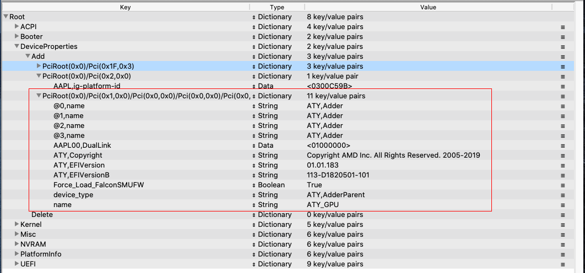
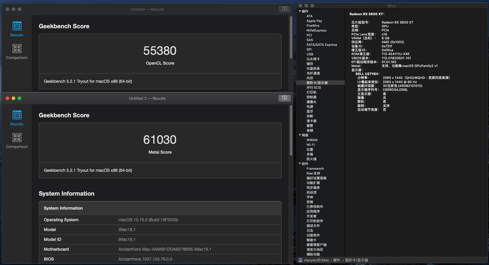
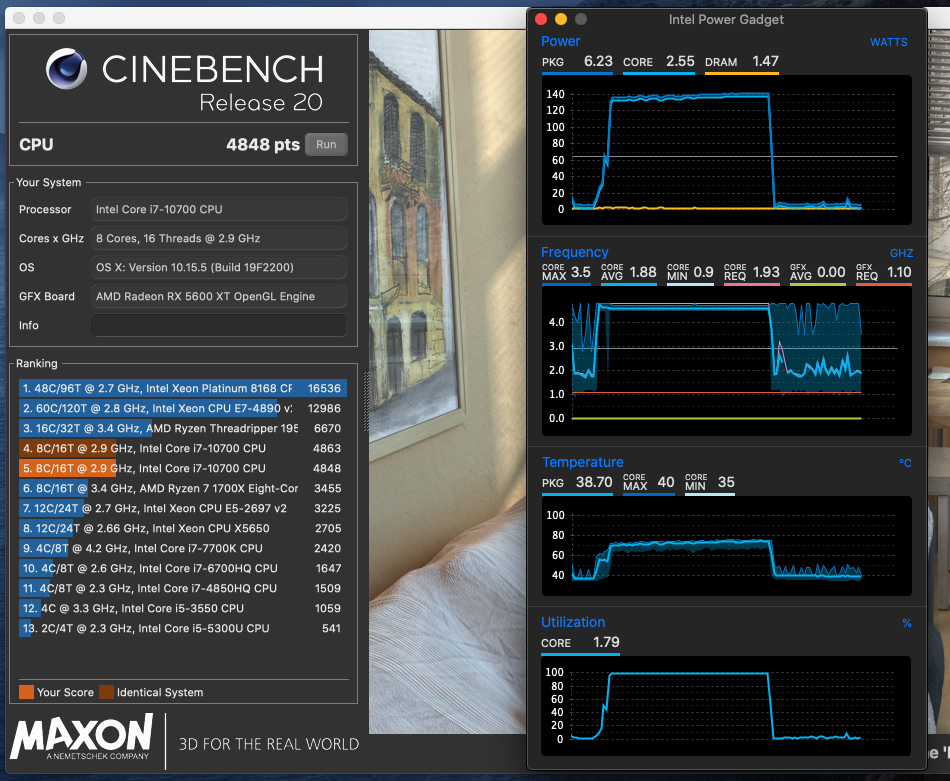
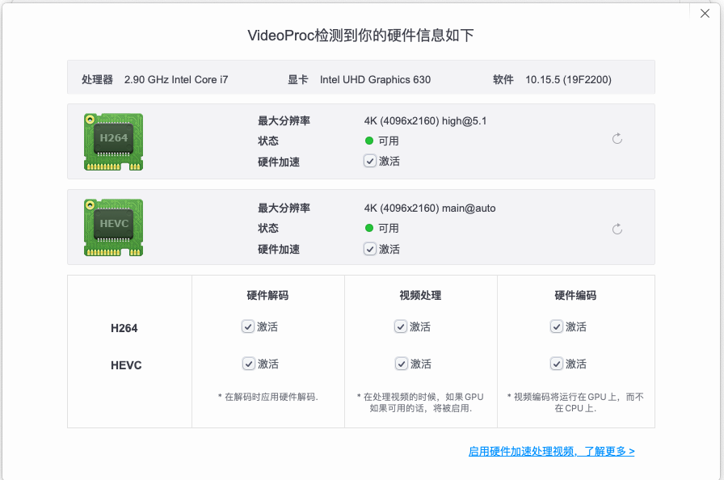
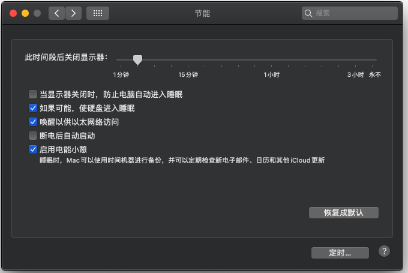
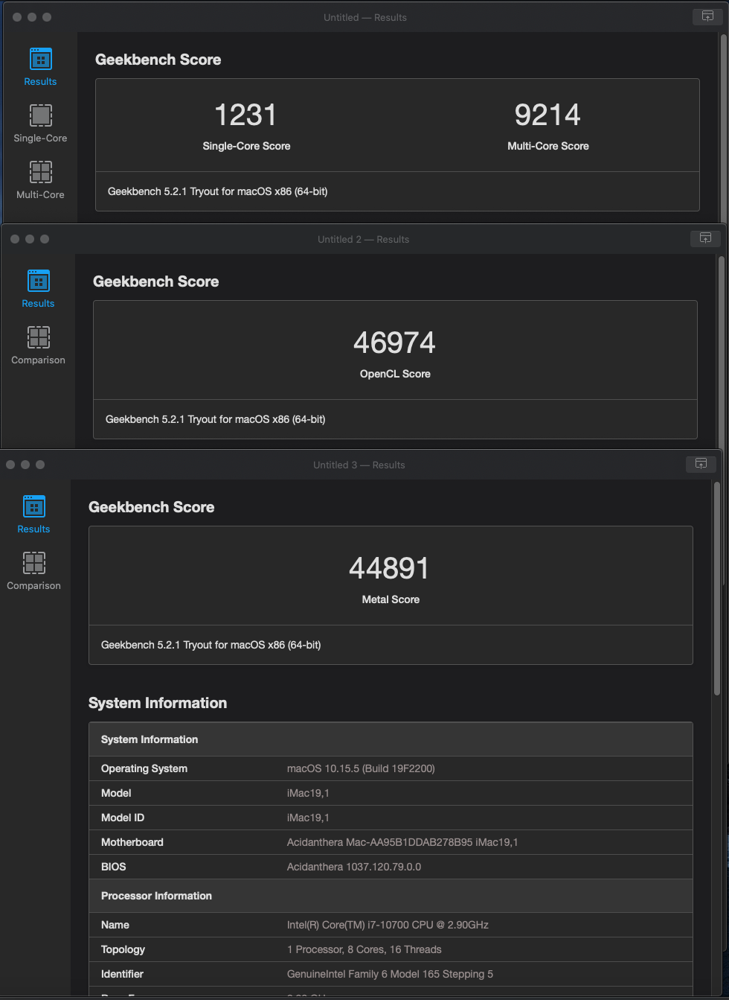

# Hackintosh-Z490-ASRock-Steel-Legend-Intel-i7 10700

| 硬件配置 ||
|---|----------------------------------|
| 主板  | 华擎（ASRock）Z490 Steel Legend 钢铁传奇 |
|CPU|Intel i7-10700                      |
|内存|海盗船 DDR4 3200 16G X 2|
|显卡|蓝宝石（Sapphire）RX 5600XT|
|SSD|西数 SN750 500G X 2|
|Wifi/蓝牙|Broadcom BCM94360CD|

macOS Big Sur 11.4

按照官方指引 Comet Lake 做的引导

OpenCore 0.7.0 

https://dortania.github.io/OpenCore-Install-Guide/prerequisites.html

* 官方文档中在 “Creating the USB” --- "Windows install" 中创建的安装U盘是恢复镜像，安装过程中必须要有网络，我这里没有安装黑苹果免驱的无线网卡，板载2.5G网卡驱动需要手工配置才可使用，安装界面无法修改，打开“终端”执行命令：
    `ifconfig en0 media 1000baseT ` （感谢[id86021](https://github.com/xiaoyaowx/Hackintosh-Z490-ASRock-Steel-Legend-Intel-10700/issues/2#issue-651397552)）

* BIOS设置参考官方文档中的配置，没有正确设置会导致卡屏进不了安装界面等问题  https://dortania.github.io/OpenCore-Install-Guide/config.plist/comet-lake.html#intel-bios-settings
-------
2021.06.15
* 更新OpenCore 0.7.0 ,更新Kexts驱动
-------
2020.10.10
* 更新OpenCore 0.6.2 ,更新Kexts驱动
* 实测新版本AppleALC已经支持板载声卡，去掉了仿冒驱动，引导参数添加了 alcid=49
（iStat Menus中CPU温度传感器无法显示，其它软件中可正常显示）

-------
2020.08.25
* 更新OpenCore 0.6.0 ,更新Kexts驱动

-------
2020.07.20
* 新加了块Broadcom BCM94360CD无线网卡（4天线）,EFI未做任何修改，开机Wifi,蓝牙功能都正常
* * 休眠唤醒以后Wifi网络变慢，可以在节能选项中取消”唤醒以供网络访问“选项
* * 蓝牙功能需要连接主板内置9针USB口，需要重新定制USB端口

-------
2020.07.07

* 注入显卡优化参数，5600/5700xt都适用，主要是注入ROM号和VBIOS版本号，之前有直接加载RadeonBoost.kext的懒人方法，实测5000系的显卡已经无效（https://www.insanelymac.com/forum/topic/343461-kext-tired-of-low-geekbench-scores-use-radeonboost/）

注入后的Geekbench测试得分有提升，Final Cut Pro的视频导出度也有非常明显的提高（原来15秒左右，现在9秒）

参考

https://www.tonymacx86.com/threads/amd-radeon-performance-enhanced-ssdt.296555/

http://bbs.pcbeta.com/forum.php?mod=viewthread&tid=1839725&highlight=5700xt

-------
2020.07.05

## 目前已知问题：
* BIOS中开启 “USB鼠标开机，USB键盘/远程开机，PCIE设备开机” 后，关机会卡住无法关机 

-------
## 相关配置说明：
ACPI
1. SSDT-AWAC.aml
2. SSDT-EC.aml
3. SSDT-PLUG.aml
4. SSDT-USBX.aml 
5. SSDT-PMCR.aml （修正节能第5项，如果不加默认是4项，非强迫症可忽略）
6. SSDT-SBUS-MCHC.aml (修复SMBus support) 

Kexts
1. AppleALC.kext
2. FakePCIID_Intel_HDMI_Audio.kext  板载ALC1200需要仿冒声卡才可以驱动
3. FakePCIID.kext
4. Lilu.kext
5. LucyRTL8125Ethernet.kext   板载2.5G网卡驱动（网卡设置“高级-硬件”中将速率改为1000baseT）
6. SMCProcessor.kext
7. SMCSuperIO.kext
8. USBPorts.kext
9. VirtualSMC.kext
10. WhateverGreen.kext

* 在使用USBInjectAll.kext的时候发现系统USB设备HS13被识别为LED Controller 应该和主板的LED光效有关，重启进入Bios后会造成Bios中的主板LED光效开关失效，只能重新定制USBPort.kext，将HS13设备排除

-------
CPU，内存，显卡识别正常

CINEBENCH R20跑分，CPU变频正常

核显硬件加速正常

修眠正常

Geekbench CPU和显卡测试

