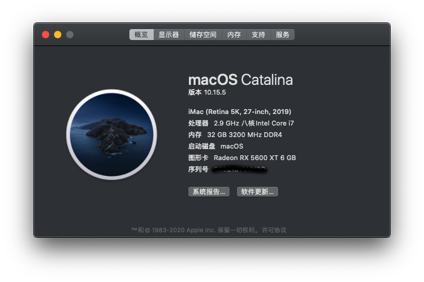

# Hackintosh-Z490-ASRock-Steel-Legend-Intel-i7 10700
硬件配置

| 主板  | 华擎（ASRock）Z490 Steel Legend 钢铁传奇 |
|---|----------------------------------|
|CPU|Intel i7-10700                      |
|内存|海盗船 DDR4 3200 16G X 2|
|显卡|蓝宝石（Sapphire）RX 5600XT|
|SSD|西数 SN750 500G X 2|

macOS Catalina 10.15.5

OpenCore 0.5.9 

